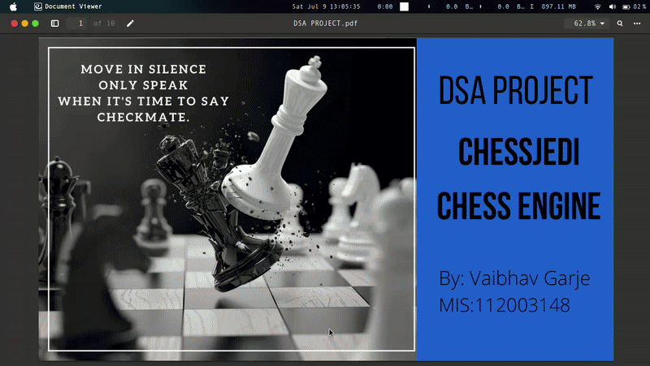

# ChessJedi
A chess program written in C  using MinMax algorithm that can be played on the command line.

## Features:
* Single-Player(Playing against the computer) and Dual Player Mode.
* Supports Forsyth Edwards Format for storing board position FEN is a format which stores the state of the chessboard as a string.
* We can choose the hardness level although requires good computing power for a hard(depth 8) level.
* Can detect en passant square if there exists one.
* Checks for the 50 move rule
* Checking for Invalid moves made
* Has a unique hashey for each position on the board.
* Maintains history of all the moves played so you can perform a takeback in case a wrong move is played.

## Getting Started
 * First clone the repo using command below:
  ```
   git clone https://github.com/vaibhavg20comp/chess.git
  ```
 * Run the file ChessJedi.c using command:
 ```
  gcc -o ChessJedi ChessJedi.c
 ```
 
 * Run the executable by putting below in terminal:
 ```
  ./ChessJedi
 ```
 * Select the mode and the hardness level. To make a move just enter the source positon and destination position of the piece.
   Eg. 'e2e4' will move the piece(intitially pawn) from square e2 to square e4.
 * In case you want to search the best move by going into a certain depth you can press 's'. 
 * To takeback a move press 't'.
  <p align="center">
    
  </p>
 * Enjoy!!


## FutureScope
* Adding GUI to the engine
* Adding a provision to save the current game.
* Adding timer to the gameplay and other modes like Bullet , Classic etc.
* Add some book moves(sort of lookup table) in the game to allow faster response to certain move patterns.
* Variable tree depth- when situation is dynamic(king in check or exchange going on).
## Some Amazing Resources 

* https://www.linkedin.com/pulse/writing-simple-chess-engine-c-baran-can-%C3%B6ner-cfa/
* https://hbr.org/2017/04/why-you-should-have-at-least-two-careers-utm_medium=social&utm_source=facebook&utm_campaign=hbr
* https://home.hccnet.nl/h.g.muller/max-src2.html
* https://www.chessprogramming.org/Main_Page


